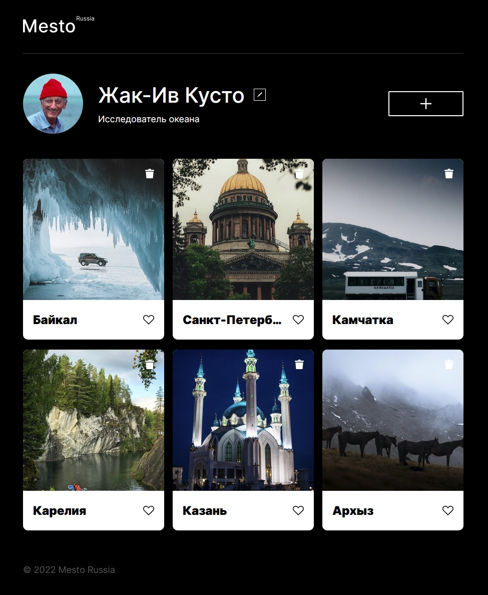

# Сайт "Mesto Russia"

## Превью сайта

## Описание проекта

В проекте использована методология БЭМ Nested, сайт-лендинг адаптирован под экраны от 320 до 1280 пикселей. На сайте можно добавлять карточки различных мест, удалять и лайкать, редактировать профиль. Присутствует валидация.

## Технологии, использованные в проекте

* HTML
* CSS (FlexBox, Grid)
* БЭМ
* JavaScript
* React

## Ссылка на дэплой проекта

[GitHub Pages](https://mvttsun.github.io/mesto-react/)
